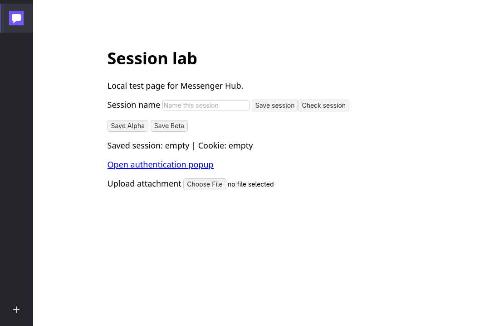

<p align="center">
  
</p>

<h1 align="center">Messenger Hub</h1>

<p align="center">
  A lightweight native Linux app that keeps messaging services in one focused window.<br>
  Built with Go, GTK4, and the system WebKitGTK engine — no Electron or bundled browser.
</p>

<p align="center">
  
  
  
  
</p>



> The screenshot uses a local test service and contains no personal account data.

## Why Messenger Hub?

Messenger Hub gives each service its own persistent browser profile while keeping the application shell compact. Cookies, local storage, cache, permissions, and authentication state remain isolated between service instances — including multiple accounts for the same provider.

The active website gets almost the entire window. A narrow favicon rail handles switching, while service controls stay available from the icon's context menu.

## Features

- Native GTK4 interface with a compact dark service rail.
- Real site favicons, cached locally after the first successful load.
- Independent persistent WebKit profiles for every service instance.
- Multiple accounts for the same provider.
- Presets for WhatsApp, Microsoft Teams, Messenger, Instagram, Telegram, Discord, Slack, Google Chat, Element, Gmail, Outlook, Google Messages, and Proton Mail.
- Support for any custom HTTP or HTTPS web application.
- Enable, disable, refresh, home, and manage actions from each service's context menu.
- Persistent drag-and-drop service ordering.
- Per-service data clearing with confirmation.
- Native permission prompts, file selection, and authentication popups.
- Persistent window size and maximized state, plus safe X11 position restoration.
- English interface and keyboard-accessible controls.

## Install

### GNOME launcher and user installation

```bash
git clone https://github.com/AndreiTelteu/messenger-hub.git
cd messenger-hub
./scripts/install.sh --user
```

This installs the binary in `~/.local/bin` and adds **Messenger Hub** to GNOME Activities.

### System installation

```bash
./scripts/install.sh --system
```

The installer builds and tests the app, installs it under `/usr/local`, adds the `.desktop` launcher and icon, then refreshes the desktop database. It uses `sudo` only for the installation steps.

### Build without installing

```bash
make build
./bin/messenger-hub
```

## Requirements

- Linux
- Go 1.24 or newer
- GTK4
- WebKitGTK 6.0

| Distribution | Runtime packages |
| --- | --- |
| Arch Linux / CachyOS | `gtk4 webkitgtk-6.0` |
| Fedora | `gtk4 webkitgtk6.0` |
| Recent Debian / Ubuntu | `libgtk-4-1 libwebkitgtk-6.0-4` |

Package names and WebKitGTK availability can vary between distribution releases.

## Usage

1. Select the **+** button and choose a preset or enter a custom URL.
2. Sign in inside the service page. Its session is stored only in that service's local profile.
3. Select a favicon to switch services.
4. Right-click a favicon for **Disable/Enable**, **Refresh**, **Home**, and **Manage**.
5. Drag service icons to reorder them.

| Shortcut | Action |
| --- | --- |
| `Ctrl+N` | Add a service |
| `Ctrl+R` | Refresh the active service |
| `Ctrl+1` … `Ctrl+9` | Select a service by rail position |
| `Menu` or `Shift+F10` | Open the focused service menu |

## Privacy and local data

Messenger Hub does not proxy traffic, sync account data, or upload application telemetry. Websites load directly through the system WebKitGTK engine.

- Settings: `$XDG_CONFIG_HOME/messenger-hub/state.json`
- Profiles: `$XDG_DATA_HOME/messenger-hub/profiles/<ID>`
- Cache: `$XDG_CACHE_HOME/messenger-hub/profiles/<ID>`

The settings file is written atomically with private permissions. A profile lock prevents two app processes from using the same data directory simultaneously.

## Compatibility notes

Messenger Hub is a native web wrapper, not an API integration with the listed providers. A provider may restrict embedded browsers, expire sessions, or change its web client at any time. Calls, screen sharing, notifications, codecs, and OAuth flows depend on WebKitGTK, GStreamer, desktop portals, and each provider's own policy.

## Development

```bash
make check
go test -race ./internal/model
go test -tags integration ./internal/browser -run TestViewRuntime -v
```

Run the local fixture with fake session data:

```bash
python3 scripts/session-fixture.py
./bin/messenger-hub --profile /tmp/messenger-hub-test
```

See [VERIFICATION.md](VERIFICATION.md) for tested Linux scenarios and [DESIGN.md](DESIGN.md) for the interface system.

## Project structure

- `cmd/messenger-hub` — application bootstrap and XDG profile setup.
- `internal/model` — service catalog, validation, persistence, and state transitions.
- `internal/browser` — WebKit profiles, permissions, popups, and lifecycle.
- `internal/ui` — native GTK shell, dialogs, actions, and window behavior.
- `packaging` — desktop launcher and application icon.
- `scripts` — installer and local browser fixture.
